# Kubernetes Deployment

<h1 align="center">
    
</h1>

## Start up the Redis Database

### Creating the Redis Deployment :
    
<h1 align="center">
    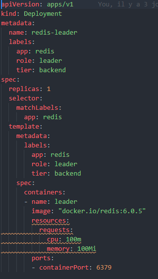
</h1>
    
    Apply the Redis Deployment from the redis-leader-deployment.yaml file:
    kubectl apply -f .\redis-deploy.yaml

    verification of our deployments
    kubectl get deploy
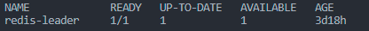

### Creating the Redis service :
    
<h1 align="center">
    
</h1>
    
    Apply the Redis Service from the following redis-leader-service.yaml file:
    kubectl apply -f .\redis-service.yaml

    verification of our service
    kubectl get svc
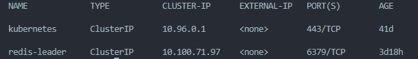

### Set up Redis followers :

<h1 align="center">
    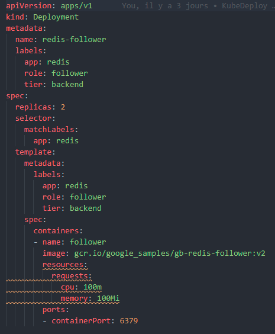
</h1>

    Apply the Redis Deployment from the following redis-follower-deployment.yaml file:
    kubectl apply -f .\redis-follower-deployment.yaml

    verification of our deploy
    kubectl get deploy

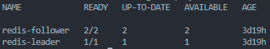

### Creating the Redis follower service :

<h1 align="center">
    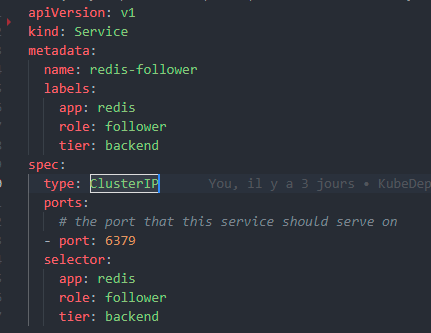
</h1>

    Apply the Redis Service from the following redis-follower-service.yaml file:
    kubectl apply -f .\redis-follower-service.yaml

    verification of our service
    kubectl get deploy

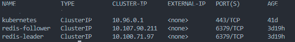

## Set up and Expose the Guestbook Frontend

### Creating the Guestbook Frontend Deployment :

<h1 align="center">
    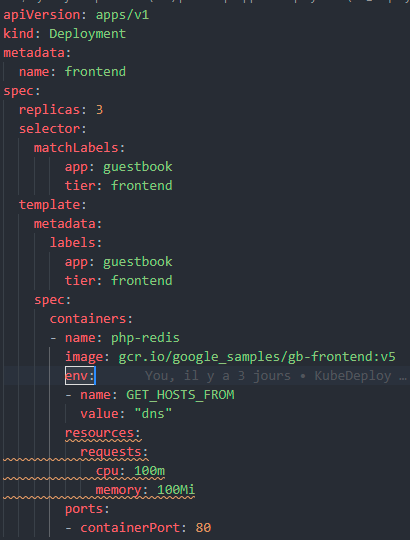
</h1>

    Apply the frontend Deployment from the frontend-deployment.yaml file:
    kubectl apply -f .\frontend-deployment.yaml

    verification of our deployment
    kubectl get deploy

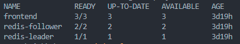

### Creating the Frontend Service :

<h1 align="center">
    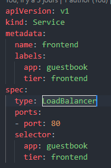
</h1>

    Apply the frontend Deployment from the frontend-deployment.yaml file:
    kubectl apply -f .\frontend-service.yaml

    verification of our service
    kubectl get service

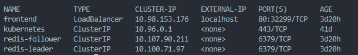

Go to http://localhost:80 AND Enjoy :call_me_hand:

    

